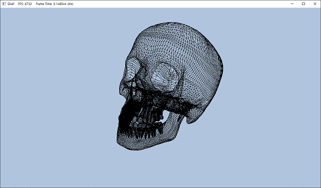
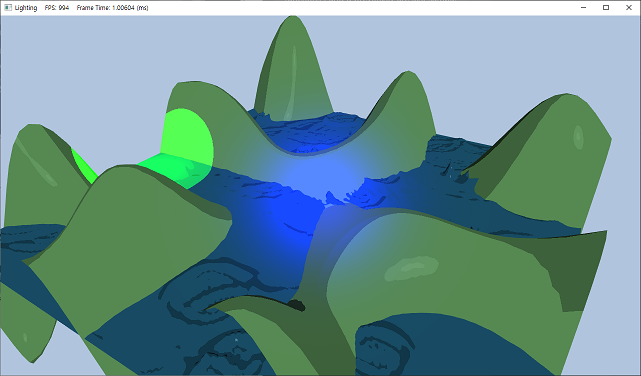

## Introdution.

I am uploading the learning outcomes of each chapter after reading [Introduction to 3D Game Programming with DirectX 11](https://www.amazon.com/Introduction-3D-Game-Programming-DirectX/dp/1936420228/ref=sr_1_1?crid=2E7VDHM5C93ER&dib=eyJ2IjoiMSJ9.leq7RVp17J6jH-z3sfhGUdxRFY2Pa7B758d88zZfLei_h6JtBjy7uHBl3xX3CWmzEaehthJFnHvwWS_W1U3PFfj4FRYEQvjYkBiz7kY5X7qTq3pgyTI9bI6EU_l0Mo4spOfQdiOqnOq1y9pcCC9xA2nk49oQ9nUiyMI__O2LggQYtkZOB3MlctS8ff-fJLdn_RkXMZ_2P0y7NFEkSIKm0NuH48JV65ArkzMXDzFhf_Q.-NocVSzeMQY4mb_ztCz-fKJ3VwSWNYXTXAlClNME4RA&dib_tag=se&keywords=directx+11&qid=1719977569&sprefix=%2Caps%2C237&sr=8-1) by Frank Luna.

## Contents.

> __[Chapter4. Direct3D Initialization](chapter4/)__

> __[Chapter6. Drawings in Direct3D](chapter6/)__

Demo Pictures

> __[Chapter7. Lighting](chapter7/)__

Demo Pictures

> __[Chapter8. Texturing](chapter8/)__

Demo Pictures

  

> __[Chapter9. Blending](chapter9/)__

Demo Pictures

> __[Chapter10. Stenciling](chapter10/)__

Demo Pictures

> __[Chapter11. Geometry Shader](chapter11/)__

Demo Pictures

> __[Chapter12. Compute Shader](chapter12/)__

Demo Pictures

> __[Chapter13. Tessellation Stage](chapter13/)__

Demo Pictures

> __[Chapter14. First Person Camera](chapter14/)__

Demo Pictures

> __[Chapter15. Instancing and Culling](chapter15/)__

Demo Pictures

> __[Chapter16. Picking](chapter16/)__

Demo Pictures

> __[Chapter17. Cube Mapping](chapter17/)__

Demo Pictures

> __[Chapter18. Normal Mapping and Displacement Mapping](chapter18/)__

Demo Pictures

> __[Chapter19. Terrain Rendering](chapter19/)__

Demo Pictures

## Diffrence from a book.

### 1. `Effects11.lib`
The `Effects11.lib` library provided in the book is  built for Visual Studio 2010 and is no longer supported in later versions. If you want to use `Effects11.lib` with a higher version of Visual Studio, try building it from [this repository](https://github.com/microsoft/FX11). I also use Visual Studio 2022, and it has been extremely helpful.

### 2. `DirectXTex.lib`
According to MSDN, `D3DX11CreateShaderResourceViewFromFile` function and the D3DX utility library are deprecated in Windows 8 and later versions. To replace them, build the [DirectXTex](https://github.com/microsoft/DirectXTex) project and link it as a new library.

### 3. `DirectXCollision.h`
In this code, we use the `DirectXCollision.h` header file instead of the `xnacollision.h` header file used in the book. Therefore, functions used in the demo, such as `XNA::IntersectRayTriangle`, are replaced with `TriangleTests::Intersects`.